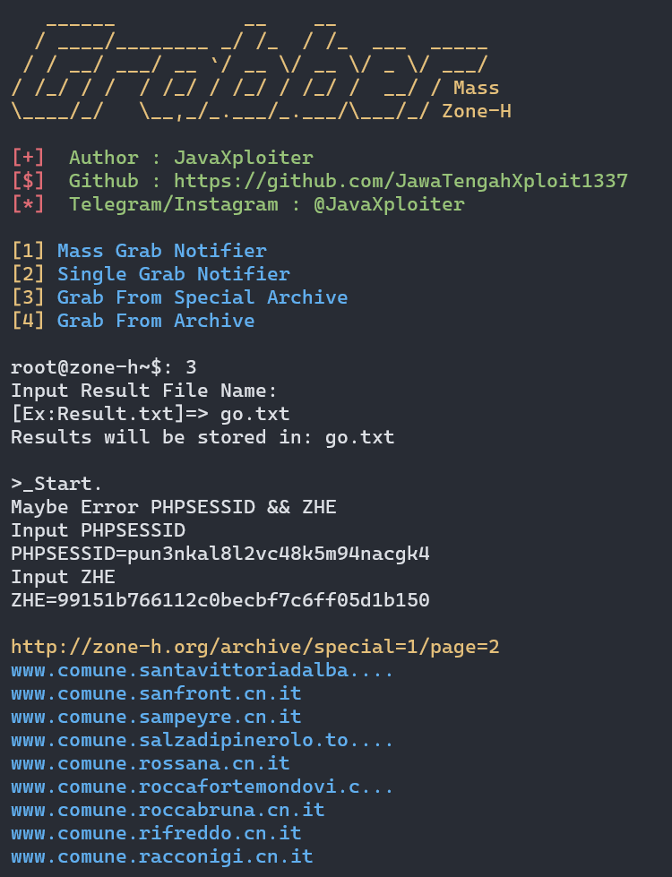

<p align="center">
	
</p>

# Zone-H Notifier Grabber

*Zone-H Notifier Grabber adalah tools berbasis Python untuk mengambil data dari **Zone-H Archive**, terutama untuk mencari daftar domain yang diarsipkan berdasarkan **notifier** tertentu. Tools ini memanfaatkan sesi autentikasi menggunakan cookie (`PHPSESSID` dan `ZHE`) untuk mengakses dan mengekstrak data secara efisien.*

## 🤖Fitur Utama
1. **Mass Grab Notifier**:
   - Mengambil data domain yang diarsipkan dari daftar nama notifier secara massal.
2. **Single Grab Notifier**:
   - Mengambil data domain dari satu nama notifier tertentu.
3. **Grab From Special Archive**:
   - Mengambil data domain dari arsip spesial Zone-H.
4. **Grab From Archive**:
   - Mengambil data domain dari arsip umum Zone-H.

## 💻Persyaratan
- **Python 3.x** (rekomendasi)
- Paket tambahan:
  - `requests` (untuk HTTP request)

### ⌨️Instalasi Paket
Pastikan Anda menginstal semua dependensi yang diperlukan dengan perintah berikut:
```bash
pip install requests
```

## ⚙️Cara Menggunakan
1. **Clone Repository**:
   Clone tools ini ke direktori lokal Anda:
   ```bash
   git clone https://github.com/<username>/<repository>.git
   cd <repository>
   ```

2. **Jalankan Tools**:
   Jalankan script Python:
   ```bash
   python script_name.py
   ```
   Ganti `script_name.py` dengan nama file script Anda.

3. **Masukkan Input yang Diminta**:
   - Anda akan diminta memasukkan **PHPSESSID** dan **ZHE**, yang dapat ditemukan di cookies akun Zone-H Anda. Jika sudah memiliki file `.PHPSESSID` dan `.ZHE`, tools akan memuatnya secara otomatis.

4. **Pilih Menu**:
   Pilih salah satu dari menu yang tersedia:
   - **Mass Grab Notifier**: Menggunakan file daftar nama notifier.
   - **Single Grab Notifier**: Menggunakan satu nama notifier.
   - **Grab From Special Archive** atau **Grab From Archive**: Mengambil data dari arsip Zone-H.

5. **Hasil Grab**:
   - Semua domain yang berhasil diambil akan disimpan dalam file hasil, dengan nama yang dapat Anda tentukan saat tools dijalankan.

## 🧾️Output
Hasil akan disimpan dalam file teks di direktori yang sama dengan script, misalnya:
```
Results.txt
```

## ⚠️Disclaimer
*Tools ini dibuat hanya untuk tujuan edukasi dan penelitian. Penulis tidak bertanggung jawab atas penyalahgunaan tools ini. Pastikan Anda mematuhi aturan hukum yang berlaku di wilayah Anda.*

---

